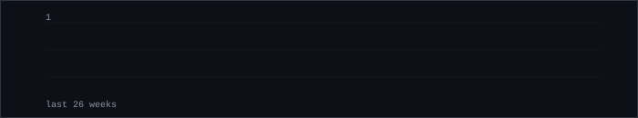
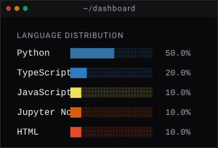

# Shreyas S

*AI/ML student, working through the fundamentals in public.*

<!-- EDIT: Update the line below with what you're currently working on or learning. Keep it specific and honest. -->
> `// currently exploring:` building ML models in Jupyter and studying data preprocessing pipelines

---

### `FOCUS`

| Area | Status |
|---|---|
| Machine Learning | `Learning` |
| Data Science | `Exploring` |
| Generative AI | `Exploring` |
| AI Applications | `Building` |

<!-- EDIT: Update the status for each area honestly. Use only: Learning / Exploring / Building. Never use "Expert" or "Master". -->

---

### `LOG`

<!-- EDIT: Each entry below is based on your real repos. Replace Problem/Approach/Result with your own honest descriptions. The dates are real. -->

**`[Aug 2026]` AI/ML Explorations**
- **Problem:** Building practical understanding of core ML algorithms and data workflows
- **Approach:** Implementing models in Jupyter Notebooks — supervised learning, data analysis, visualization
- **Stack:** `Python` · `Jupyter Notebook` · `pandas` · `scikit-learn`
- **Result:** Growing collection of ML experiments and data analysis notebooks
- → [aiml](https://github.com/shreyas123S/aiml)

<!-- EDIT -->
**`[Feb 2026]` Personalized News Aggregator**
- **Problem:** Information overload — too many sources, no personalization
- **Approach:** Built an API-driven news aggregation system with filtering logic
- **Stack:** `Python`
- **Result:** Working aggregator that surfaces relevant news based on preferences
- → [Personalized_News_Aggregator](https://github.com/shreyas123S/Personalized_News_Aggregator)

<!-- EDIT -->
**`[Dec 2025]` Vision 2047**
- **Problem:** Building a forward-looking application with modern web technologies
- **Approach:** Full-stack TypeScript application
- **Stack:** `TypeScript` · `JavaScript` · `HTML` · `CSS`
- **Result:** Deployed web application
- → [Vision_2047](https://github.com/shreyas123S/Vision_2047)

<!-- EDIT -->
**`[Oct 2025]` Inshorts API Host**
- **Problem:** Needed a self-hosted API endpoint for programmatic news access
- **Approach:** Built a lightweight Python API service, open-sourced under MIT license
- **Stack:** `Python`
- **Result:** Deployable API service
- → [inshorts-api-host](https://github.com/shreyas123S/inshorts-api-host)

---

### `SIGNAL`

---

### `STACK`

<!-- EDIT: Update these lists to reflect your actual skills. Be honest — list what you've used. -->

| | |
|---|---|
| **AI/ML** | scikit-learn · pandas · NumPy · Jupyter · Matplotlib |
| **Data** | SQL · CSV/JSON processing · REST APIs |
| **Languages** | Python · TypeScript · JavaScript |
| **Tools** | Git · GitHub Actions · VS Code |

---

*This README is generated by a custom data pipeline — not a third-party stats service.* · [GitHub](https://github.com/shreyas123S) <!-- EDIT: add your LinkedIn link --> <!-- EDIT: add your email -->
